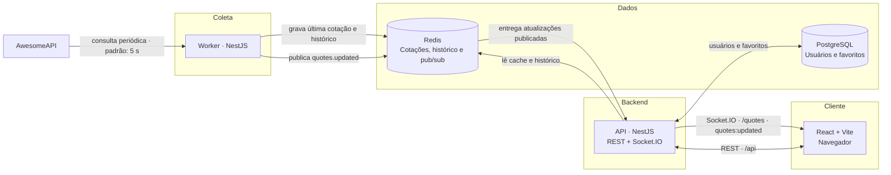

# Currency Quotes

Aplicação full stack para acompanhar, em tempo real, cotações de moedas e criptoativos em relação ao real brasileiro (BRL). A interface permite pesquisar ativos, consultar seu histórico recente e salvar favoritos em uma conta. As cotações são coletadas da [AwesomeAPI](https://docs.awesomeapi.com.br/), armazenadas no Redis e distribuídas às instâncias da API por WebSocket.

> Os valores exibidos são informativos e não constituem recomendação de investimento.

## Índice

- [Recursos](#recursos)
- [Arquitetura](#arquitetura)
- [Tecnologias](#tecnologias)
- [Pré-requisitos](#pré-requisitos)
- [Início rápido com Docker](#início-rápido-com-docker)
- [Variáveis de ambiente](#variáveis-de-ambiente)
- [API HTTP](#api-http)
- [Atualizações em tempo real](#atualizações-em-tempo-real)
- [Cotações suportadas](#cotações-suportadas)
- [Comandos úteis](#comandos-úteis)
- [Estrutura do repositório](#estrutura-do-repositório)
- [Decisões técnicas](#decisões-técnicas)
- [Solução de problemas](#solução-de-problemas)

## Recursos

- Exibe a última cotação de dez pares contra BRL, com compra, venda, máxima, mínima e variação percentual.
- Atualiza os dados em tempo real, sem recarregar a página.
- Mantém até 360 observações por par no Redis para alimentar o gráfico histórico.
- Permite filtrar cotações e destacar favoritos.
- Oferece cadastro e autenticação com JWT; os favoritos autenticados são persistidos no PostgreSQL.
- Expõe documentação interativa da API com Swagger.
- Inclui health check, validação de entradas, `helmet`, CORS configurável e limitação global de 100 requisições por minuto.

## Arquitetura



O worker é o único componente que consulta o provedor externo. Ele grava o estado e publica uma mensagem no Redis. Cada instância da API pode então retransmitir a mesma atualização via Socket.IO, sem multiplicar chamadas à AwesomeAPI — uma base adequada para escalar a API horizontalmente.

API e worker seguem Clean Architecture: o domínio e os casos de uso dependem de portas; Redis, Prisma, JWT, scrypt e AwesomeAPI são adaptadores de infraestrutura. Isso mantém as regras de negócio independentes das tecnologias usadas.

## Tecnologias

| Camada | Tecnologias |
| --- | --- |
| Frontend | React 19, TypeScript, Vite, TanStack Query, Recharts e Socket.IO Client |
| API | NestJS 12, Swagger, Socket.IO, Prisma, JWT, scrypt, class-validator e Helmet |
| Coleta | NestJS Schedule e AwesomeAPI |
| Dados | PostgreSQL 17 e Redis 7 |
| Ferramentas | pnpm workspaces, Turborepo, Docker Compose, Vitest, ESLint e Oxc Lint |

## Pré-requisitos

Para a forma recomendada de executar o projeto, instale apenas:

- [Docker Desktop](https://www.docker.com/products/docker-desktop/) com Docker Compose v2;
- uma porta livre para `3000` (API), `5173` (web), `5432` (PostgreSQL) e `6379` (Redis).

## Início rápido com Docker

1. Crie o arquivo de configuração a partir do exemplo:

   ```powershell
   Copy-Item .env.example .env
   ```

   Em macOS/Linux, use `cp .env.example .env`.

2. Altere `JWT_SECRET` no `.env` para um valor longo, aleatório e privado. `AWESOME_API_KEY` é opcional; uma chave do provedor evita o cache de um minuto da API pública.

3. Suba os serviços:

   ```bash
   docker compose up --build
   ```

4. Abra os endereços abaixo quando os logs indicarem que os serviços estão prontos:

   | Serviço | Endereço |
   | --- | --- |
   | Aplicação web | [http://localhost:5173](http://localhost:5173) |
   | API | [http://localhost:3000/api](http://localhost:3000/api) |
   | Swagger | [http://localhost:3000/api/docs](http://localhost:3000/api/docs) |
   | Saúde | [http://localhost:3000/api/health](http://localhost:3000/api/health) |

O Compose inicializa PostgreSQL e Redis, aplica as migrations, gera o Prisma Client e só então inicia a API. Também sobe o worker e o frontend com recarregamento durante o desenvolvimento; nenhuma etapa adicional do Prisma é necessária nesse fluxo.

Para encerrar os contêineres, pressione `Ctrl+C` e execute:

```bash
docker compose down
```

Os dados persistem nos volumes `postgres_data` e `redis_data`. Para removê-los intencionalmente junto aos contêineres, use `docker compose down -v`.

## Variáveis de ambiente

Copie `.env.example` para `.env`; nunca versione segredos. Os valores padrão atendem ao ambiente Docker/local de desenvolvimento.

| Variável | Obrigatória | Padrão | Descrição |
| --- | --- | --- | --- |
| `POSTGRES_USER` | Sim | `currency` | Usuário do PostgreSQL no Compose. |
| `POSTGRES_PASSWORD` | Sim | — | Senha do PostgreSQL. |
| `POSTGRES_DB` | Sim | `currency_quotes` | Nome do banco. |
| `POSTGRES_PORT` | Não | `5432` | Porta publicada do PostgreSQL. |
| `REDIS_PORT` | Não | `6379` | Porta publicada do Redis. |
| `DATABASE_URL` | Sim (fora do Compose) | — | URL de conexão usada pelo Prisma. |
| `JWT_SECRET` | Sim | — | Segredo para assinar tokens JWT. Use um valor forte em produção. |
| `CORS_ORIGIN` | Não | `http://localhost:5173` | Origens permitidas, separadas por vírgula. |
| `AWESOME_API_KEY` | Não | vazio | Chave da AwesomeAPI; recomendada para reduzir o cache do provedor. |
| `AWESOME_API_URL` | Não | `https://economia.awesomeapi.com.br` | URL-base do provedor de cotações. |
| `QUOTE_POLL_INTERVAL_MS` | Não | `5000` | Intervalo de coleta do worker, em milissegundos. |
| `VITE_API_URL` | Não | `http://localhost:3000` | URL da API consumida pelo frontend. |
| `VITE_WS_URL` | Não | `http://localhost:3000` | URL do servidor Socket.IO consumida pelo frontend. |

`VITE_API_URL` e `VITE_WS_URL` são variáveis de build/execução do Vite e devem ser definidas no ambiente do frontend (por exemplo, em `apps/web/.env.local` no desenvolvimento local). No Compose, ambas já são fornecidas ao contêiner web.

## API HTTP

O prefixo de todos os endpoints é `/api`. A documentação completa e interativa está em [`/api/docs`](http://localhost:3000/api/docs).

| Método | Rota | Autenticação | Descrição |
| --- | --- | --- | --- |
| `GET` | `/health` | Não | Verifica Redis e informa quando a última cotação foi recebida. |
| `GET` | `/quotes` | Não | Retorna a última cotação disponível de todos os pares. |
| `GET` | `/quotes/:pair/history?limit=60` | Não | Retorna o histórico cronológico do par; `limit` aceita de 1 a 360. |
| `POST` | `/auth/register` | Não | Cria uma conta e retorna um token JWT. |
| `POST` | `/auth/login` | Não | Autentica uma conta e retorna um token JWT. |
| `GET` | `/favorites` | Bearer JWT | Lista os favoritos da pessoa autenticada. |
| `POST` | `/favorites/:currency` | Bearer JWT | Adiciona uma moeda aos favoritos. |
| `DELETE` | `/favorites/:currency` | Bearer JWT | Remove uma moeda dos favoritos. |

### Exemplos

Consultar as últimas cotações:

```bash
curl http://localhost:3000/api/quotes
```

Resposta resumida:

```json
{
  "data": [
    {
      "code": "USD",
      "codeIn": "BRL",
      "bid": 5.1,
      "ask": 5.11,
      "high": 5.14,
      "low": 5.06,
      "variation": 0.34,
      "updatedAt": "2026-09-15T20:00:00.000Z"
    }
  ],
  "updatedAt": "2026-09-15T20:00:05.000Z"
}
```

Criar uma conta — senha entre 8 e 72 caracteres:

```bash
curl -X POST http://localhost:3000/api/auth/register \
  -H "Content-Type: application/json" \
  -d '{"email":"ana@example.com","password":"senha-segura-123"}'
```

Adicionar USD aos favoritos (substitua `SEU_TOKEN`):

```bash
curl -X POST http://localhost:3000/api/favorites/USD \
  -H "Authorization: Bearer SEU_TOKEN"
```

## Atualizações em tempo real

O servidor Socket.IO usa o namespace `/quotes`. Ao receber uma coleta válida, a API emite o evento `quotes:updated` para os clientes conectados. O payload tem a mesma estrutura retornada por `GET /api/quotes`.

```ts
import { io } from 'socket.io-client';

const socket = io('http://localhost:3000/quotes');
socket.on('quotes:updated', (payload) => {
  console.log(payload.data, payload.updatedAt);
});
```

O frontend também faz uma consulta REST de segurança a cada 30 segundos. Assim, uma eventual desconexão temporária do WebSocket não impede que os valores sejam reconciliados.

## Cotações suportadas

| Moeda/ativo | Par |
| --- | --- |
| Dólar americano | `USD-BRL` |
| Euro | `EUR-BRL` |
| Libra esterlina | `GBP-BRL` |
| Iene japonês | `JPY-BRL` |
| Dólar canadense | `CAD-BRL` |
| Dólar australiano | `AUD-BRL` |
| Franco suíço | `CHF-BRL` |
| Yuan chinês | `CNY-BRL` |
| Bitcoin | `BTC-BRL` |
| Ether | `ETH-BRL` |

## Comandos úteis

Execute estes comandos na raiz do repositório.

| Comando | Finalidade |
| --- | --- |
| `pnpm dev` | Inicia os pacotes em modo de desenvolvimento via Turborepo. |
| `pnpm build` | Compila todos os pacotes em ordem de dependência. |
| `pnpm lint` | Executa as verificações de lint no monorepo. |
| `pnpm test` | Executa a suíte de testes. |
| `pnpm --filter api test:e2e` | Executa os testes end-to-end da API. |
| `pnpm --filter worker test:e2e` | Executa os testes end-to-end do worker. |
| `pnpm --filter api test:cov` | Gera cobertura dos testes da API. |
| `pnpm --filter worker test:cov` | Gera cobertura dos testes do worker. |
| `pnpm --filter web build` | Cria o build de produção do frontend. |

## Estrutura do repositório

```text
currency-quotes/
├── apps/
│   ├── api/                 API REST/WebSocket, autenticação e Prisma
│   ├── web/                 Interface React/Vite
│   └── worker/              Coleta e publicação das cotações
├── packages/
│   └── shared/              Tipos compartilhados entre aplicações
├── docker/node/             Imagens de desenvolvimento
├── compose.yml              Orquestração dos serviços locais
├── .env.example             Referência de configuração
├── turbo.json               Pipeline do Turborepo
└── pnpm-workspace.yaml      Definição dos workspaces
```

Nos backends, a organização interna é:

```text
src/
├── domain/          Regras e tipos do negócio
├── application/     Casos de uso, portas e erros
├── infrastructure/  Adaptadores para Redis, Prisma, segurança e provedores
└── presentation/    Adaptadores de entrada, quando aplicável
```

Os módulos HTTP/WebSocket da API (`auth`, `favorites`, `quotes` e `health`) chamam casos de uso da camada de aplicação, em vez de acessar infraestrutura diretamente.

## Decisões técnicas

- **Redis como fonte de leitura de cotações:** mantém leituras rápidas e desacopla as instâncias da API do provedor externo.
- **Worker separado:** centraliza a coleta e evita duplicidade de chamadas quando a API escala.
- **Pub/sub no Redis + Socket.IO:** entrega alterações a todos os clientes conectados e a todas as instâncias de API.
- **Histórico limitado:** cada lista do Redis conserva os últimos 360 pontos para conter o uso de memória.
- **PostgreSQL para identidade:** usuários e favoritos requerem durabilidade e relacionamento, responsabilidades adequadas ao banco relacional.
- **JWT e scrypt:** oferecem autenticação stateless e armazenamento seguro de senhas; o hash, nunca a senha, é persistido.

## Solução de problemas

| Sintoma | Verificação sugerida |
| --- | --- |
| A tela não carrega cotações | Confira `docker compose logs worker api`, aguarde a primeira coleta e acesse `/api/health`. |
| API responde 503 em `/health` | Garanta que o Redis esteja saudável com `docker compose ps` e que `REDIS_HOST`/`REDIS_PORT` estejam corretos. |
| Erro de conexão com banco | Confirme as credenciais do `.env`, aguarde o PostgreSQL ficar saudável e consulte `docker compose logs postgres migrate api`. |
| CORS ou WebSocket bloqueado | Inclua a origem do frontend em `CORS_ORIGIN`; se houver mais de uma, separe-as por vírgula. |
| Porta já está em uso | Ajuste `POSTGRES_PORT`/`REDIS_PORT` ou libere as portas `3000` e `5173` antes de subir o Compose. |
| Dados parecem parados | Verifique `QUOTE_POLL_INTERVAL_MS`, conectividade com a AwesomeAPI e, se necessário, configure `AWESOME_API_KEY`. |
